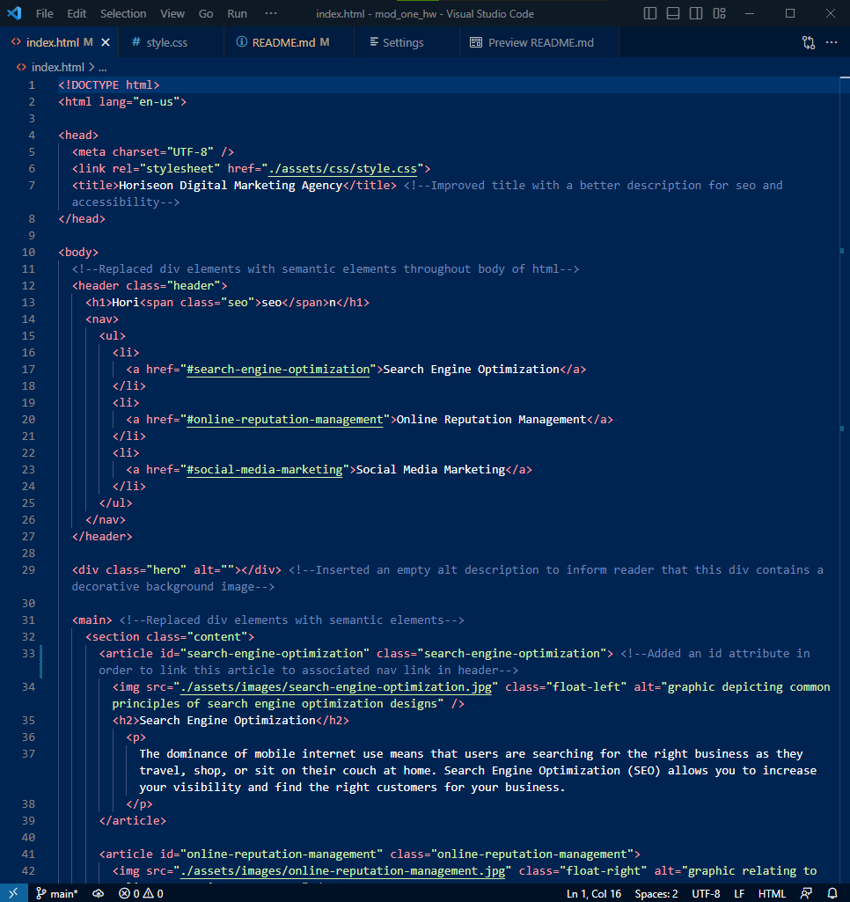
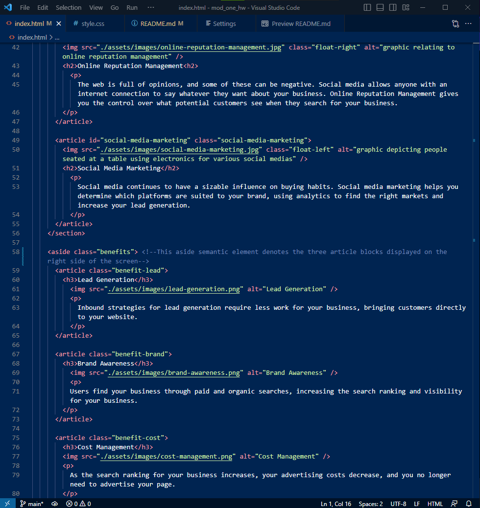
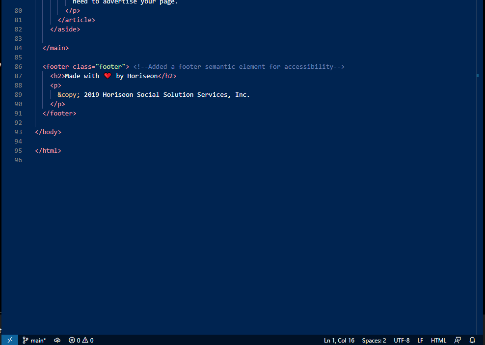

# Semantic HTML Webpage Refactor Assignment

## Description

Hello and welcome to this refactor of a less accessible webpage into a more accessible webpage based on many of the Web Content Accessibility Guidelines (WCAG). Semantic elements and attributes can help differentiate different parts of a webpage and provide context for those with disabilities.

## Usage

This refactored version contains multiple notes in the index.html file that explain primarily which elements and/or attributes were replaced with semantic elements, among other changes that were made to clean up the original codebase.

## Links

GitHub Repo: https://github.com/buster35/mod-one-semantic-html

GitHub Pages (live): 

## Screenshots

Please see the following screenshots which preview the refactored html code (with notes) in an integrated dev environment:

## License

Please refer to the LICENSE in the repo.